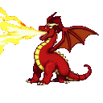
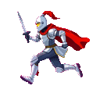

# WitMani Game Animator

[](https://opensource.org/licenses/MIT)
[](https://claude.com/code)
[](https://github.com/sephirxth/WitMani-game-animator)

Generate game character animations with AI. Text to sprite sheet in seconds.

<p align="center">
  
  
  
</p>
<p align="center"><i>Slime · Dragon · Knight Run — Classic 16-bit pixel art style</i></p>

<div align="center">
  <h3>We have discord now!<br>Click the badge to Join our community!🤩🤩🤩</h3>
  <p>
    <a href="https://discord.gg/suHDSzVRZ3" target="_blank">
      
    </a><br>
    
  </p>
  <h3>Or Scan This QR Code to Join our community!🤩🤩🤩</h3>
</div>


## Features

- **Text-to-Animation** - Describe character and action, get sprite sheet
- **Auto Preview** - Browser preview with Phaser 3 & Babylon.js
- **Multiple Formats** - Export to Phaser, Godot
- **Smart Background Removal** - Bria RMBG 2.0 AI (accurate, no color artifacts)
- **Zero Config** - Setup wizard guides you through

## Prerequisites

Before using this plugin, ensure you have:

- **Claude Code** - [Install Claude Code](https://claude.com/code)
- **ffmpeg** - Required for frame extraction
  - Ubuntu/Debian: `sudo apt install ffmpeg`
  - macOS: `brew install ffmpeg`
  - Windows: `choco install ffmpeg`
- **API Key** - One of the following:
  - [fal.ai](https://fal.ai/dashboard/keys) (recommended)
  - [Gemini](https://aistudio.google.com/apikey) (free tier available)

## Installation

```bash
# Step 1: Add the marketplace
/plugin marketplace add sephirxth/WitMani-game-animator

# Step 2: Install the plugin
/plugin install witmani@game-animator
```

After installation, **run setup**:
```bash
/witmani:setup
```

## Updating

Due to a [known Claude Code cache issue](https://github.com/anthropics/claude-code/issues/14061), `/plugin update` may not work properly.

**Full cache clear and reinstall:**
```bash
# Step 1: Uninstall
/plugin uninstall witmani@game-animator

# Step 2: Clear all cached files
rm -rf ~/.claude/plugins/cache/game-animator
rm -rf ~/.claude/plugins/marketplaces/game-animator

# Step 3: Reinstall
/plugin marketplace add sephirxth/WitMani-game-animator
/plugin install witmani@game-animator

# Step 4: Restart Claude Code to apply changes
```

## Quick Start

```bash
# Generate a pixel knight running animation
/witmani:animate "pixel knight" "running right"

# Output in animations/ folder with preview.html
```

## Commands

| Command | Description |
|---------|-------------|
| `/witmani:animate` | Generate sprite sheet animation |
| `/witmani:setup` | Configure API keys and preferences |

## Usage Examples

```bash
# Basic
/witmani:animate "fire mage" "casting spell"

# With options
/witmani:animate "cyber samurai" "sword slash" --frames 8 --fps 12

# For Godot
/witmani:animate "slime" "bouncing" --format godot
```

## Configuration

The plugin stores configuration in `~/.config/witmani/config`:

| Setting | Description | Options |
|---------|-------------|---------|
| `FAL_KEY` | fal.ai API key | Your API key |
| `GEMINI_API_KEY` | Gemini API key | Your API key |
| `BG_REMOVAL` | Background removal method | `bria`, `chromakey`, `auto` |

Run `/witmani:setup` to configure these settings interactively.

## Output

Each generation creates a folder with:

```
animations/pixel_knight_20240115/
├── pixel_knight.png      # Sprite sheet (transparent)
├── pixel_knight.json     # Animation config
├── pixel_knight.gif      # Quick preview
└── preview.html          # Interactive browser preview
```

### Browser Preview

Open `preview.html` in any browser - it auto-loads and plays your animation with Phaser 3 or Babylon.js. No server needed.

## Prompt Tips

For best results, use this formula:

```
"[character] with [details], [action], game sprite style"
```

**Good examples**:
- `"pixel knight with silver armor" "running right"`
- `"cute slime, blue and bouncy" "jumping"`
- `"fire mage in red robe" "casting fireball spell"`

**Tips**:
- Keep character description concise but specific
- Action should be clear and single (not "running and jumping")
- Add style hints: `"pixel art style"`, `"anime style"`, `"chibi"`

## Security

This plugin handles API keys securely:

- **No hardcoded keys** - All API keys are stored in user config files
- **Secure storage** - Config file permissions set to 600 (owner read/write only)
- **Environment variables** - Keys loaded from `~/.config/witmani/config`
- **No transmission** - Keys are only sent to their respective API providers

For more details, see [SECURITY.md](SECURITY.md).

## Supported Providers

| Provider | API Key | Get Key |
|----------|---------|---------|
| fal.ai | `FAL_KEY` | [fal.ai/dashboard/keys](https://fal.ai/dashboard/keys) |
| Gemini | `GEMINI_API_KEY` | [aistudio.google.com/apikey](https://aistudio.google.com/apikey) |

## Contributing

Contributions are welcome! Please feel free to submit a Pull Request.

1. Fork the repository
2. Create your feature branch (`git checkout -b feature/amazing-feature`)
3. Commit your changes (`git commit -m 'Add amazing feature'`)
4. Push to the branch (`git push origin feature/amazing-feature`)
5. Open a Pull Request

## License

MIT - See [LICENSE](LICENSE) for details.

---

Made with AI by **WitMani**
